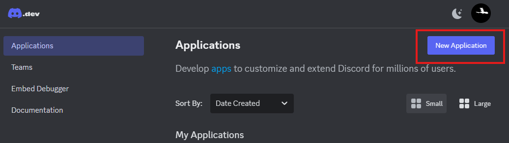
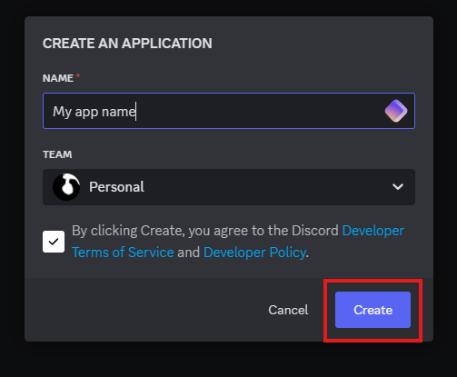
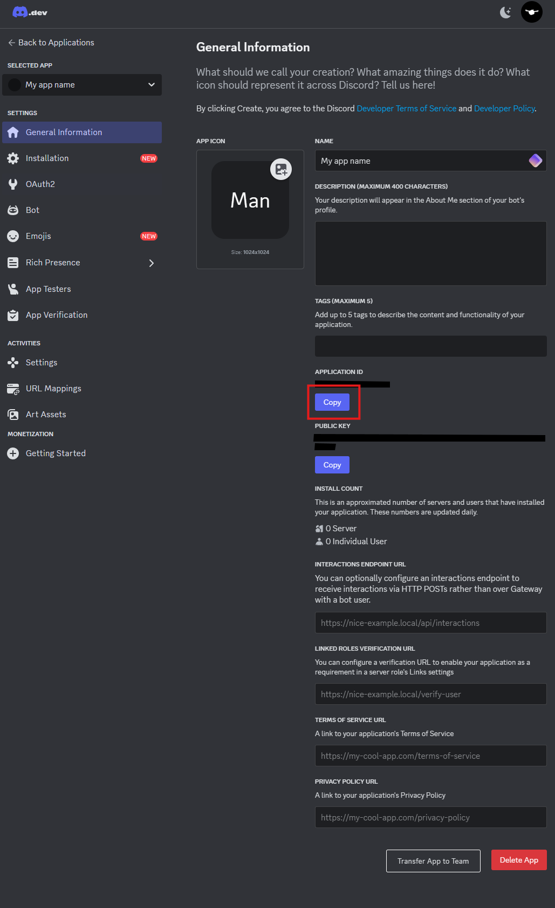
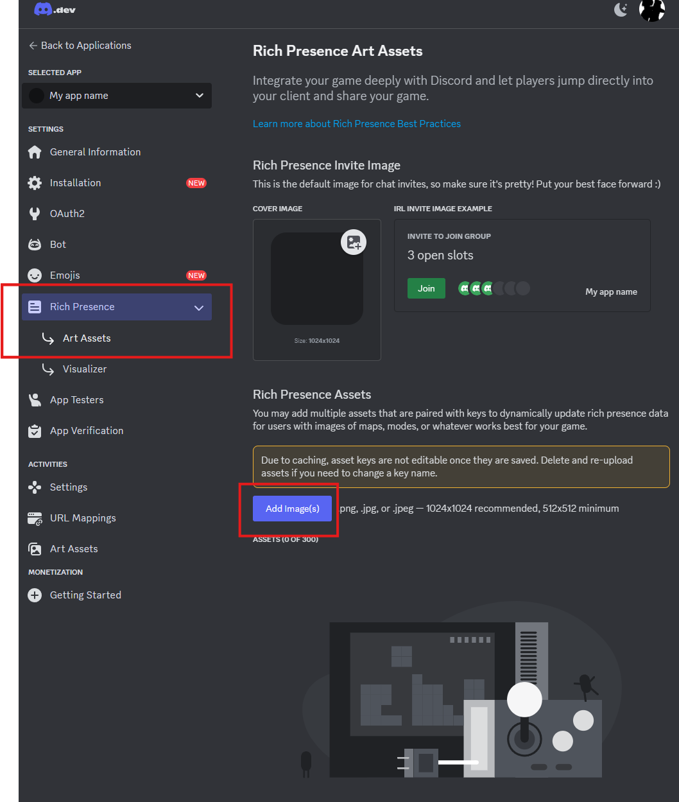
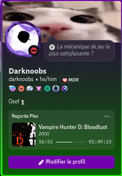

# Plex activity as Discord RPC

## Intro

This project makes a RPC in discord of your current activity on plex via Tautulli API

## Setup

The project uses Tautulli API to get your Plex activity so you obviously need to have it installed (<https://tautulli.com/#download>)

Install required packages

```bash
pip install -r requirements.txt
```

Copy the config example and update the value

```bash
cp config.example.json config.json
```

```json
{
    "apikey": "changeme", <- This is your Tautulli api key (found in Settings -> Web Interface)
    "host" : "127.0.0.1:8181", <- This the IP / domain to access Tautulli, leave it as is if Tautulli run on the same computer as the script
    "username" : "", <- Plex user to track by the script, if you leave it blank it will apply to any user
    "client_id" : "changeme", <- ID of the discord application
    "libraries": [], <- Plex library to track by the script, if you leave it blank it will apply to every library of the plex server
    "excluded_devices": [] <- List of devices to be ignored by the script, you can leave it blank if not needed
}
```

## Discord application setup

### App creation

For discord to display your RPC you need to create an application on the dev portal (<https://discord.com/developers/applications/>)

The process is very straight forward

Just click on "New Application"


Add an app name, accept the ToS and click create



After that you'll be on your newly created app page

### Setting up the discord app

On your app page you'll find your discord app ID that you need to put in your config file for the script to work


That's all you need for your app to be functionnal

But to make our RPC a bit prettier we're gonna add a few images on our app


You can use your own images or the ones in img/plex on this repo

The important part is the naming as the code lookup by name the images

Here are the categories :

- plex (default picture)
- movie
- show
- music
- play
- pause

Here's how the assets page looks with the repo images


And how the RPC looks (here while listening to music for the example)



## Launching the script

Just launch the main.py

```bash
python3 main.py
```

You may experience errors if you have medias with UTF-8 characters in the name for the logging

To avoid that you can run

```bash
python3 -X utf8 main.py
```
